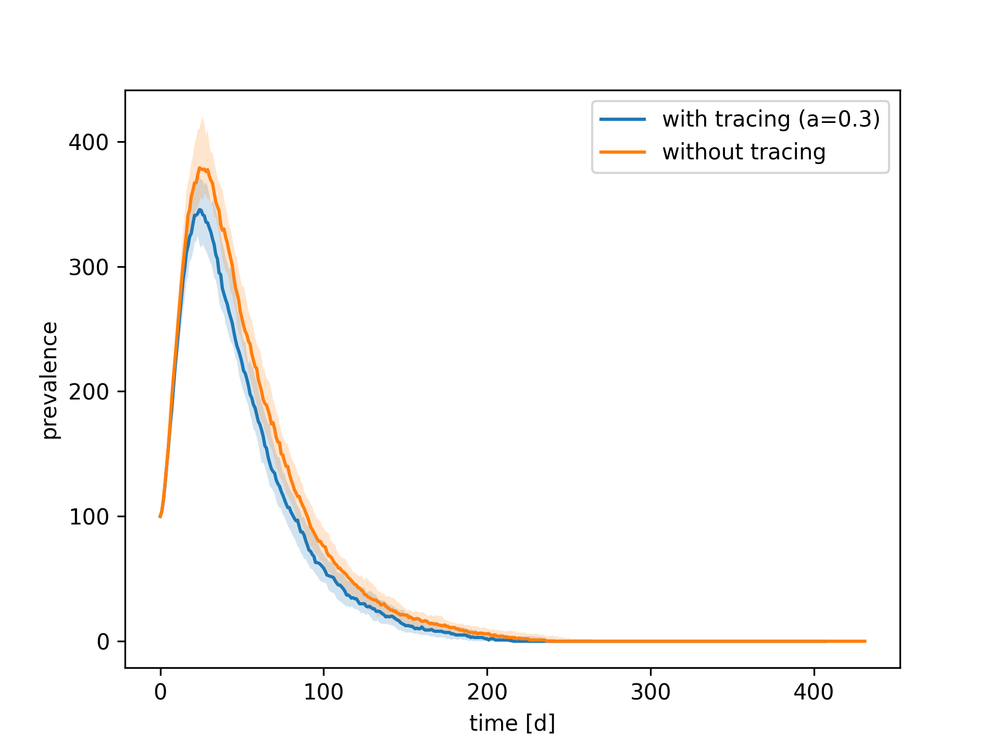

# Digital Contact Tracing

This package provides the simulation, analysis, and figure code for
the manuscript "Understanding the impact of digital contact tracing during the COVID-19 pandemic"
by A. Burdinski, D. Brockmann, and B. F. Maier.

## Prerequisites

The analysis code was used and tested for Python 3.8 on CentOS 6.10, Ubuntui 18.04, and macOS 11.3.
In order to run code in this collection, first install the requirements:

```bash
pip install -r requirements.txt
```

The requirements read

```
epipack==0.1.5
bfmplot==0.0.10
networkx==2.4
qsuite==0.4.14
smallworld==0.1.0
simplejson==3.17.2
rich==9.5.1
tqdm==4.61.2
```

Models are implemented using [epipack](github.com/benmaier/epipack). To run
large-scale simulations, we use [qsuite](github.com/benmaier/qsuite), a CLI
to facilitate simulations on HPC clusters. `qsuite` will be installed when
dependencies are installed from `requirements.txt`.

In order to have the simulations run faster, consider installing
[SamplableSet](https://github.com/gstonge/SamplableSet).

The installation process will take a few seconds.

## Main model

The main model, including an example configuration,
can be found in directory `main_model/`.

### Example 

To run the simulation, do

```bash
cd main_model/
python example.py
```

In this example, 200 simulations are run, each on a
distinctly sampled Erdos-Renyi network of `N = 10,000` nodes
with mean degree `k = 20`,
100 simulations on networks with a 30% app participation rate,
and 100 simulations on networks with no tracing app.

The code is expected to run for about 10 minutes on a "regular"
desktop PC (tested on a 2020 Macbook Pro and a small 8-core webserver). 

This is the expected output (see `main_model/example.png`).




### Usage

Change directory as `cd main_model`. Import simulation code as

```python
from simulation import simulation code
```

Then, set the model parameters

```python

N = 10_000 # number of nodes

model_parameters = dict(
    N = N,
    q = 0.3, # probability to identify&quarantine a symptomatic individual
    a = 0.3, # participation rate
    R0 = 2.5, 
    quarantiningS = True, # wether or not susceptible contacts are traced and isolated
    parameter = {
            'chi':1/2.5, # delay between test and tracing trigger
            'recovery_rate' : 1/7, # 1/(symptomatic infectious period)
            'alpha' : 1/3, # latent period
            'beta' : 1/2,  # presymptomatic infectious period
            'number_of_contacts' : 20,
            'x':0.17, # portion of asymptomatic infectious
            'I_0' : N*0.01, # initial prevalence
            'omega':1/10, # 1/(average isolation period of susceptibles)
            "y" : 0.1, # ratio of people that induce next-generation tracing
            "z": 0.64, # ratio of people sharing their test result
            "R0": 2.5,
            "network_model":'er_network', # choose between
                                          # - er_network
                                          # - confignetwork
                                          # - exp_sw_network
                                          # - swnetwork
        },
    sampling_dt = 1, # sample simulation every day
    time = 1e7,      # maximum simulation time
    )
```

Obtain simulation timeseries by calling the simulation code as 

```python
t, result = simulation_code(model_parameters)

import matplotlib.pyplot as plt

plt.(t, result['S']+result['Sa'])

print(result.keys())
```

## Manuscript analyses 

Almost all simulations and analyses performed in the paper
can be found in `analysis_collection/tracing_sim/` except for the "explicit-delay model" which can be found in `analysis_collection/excplicit_det_model.py` and the heterogeneous app participation which can be found in `figures_main_text_and_new_network_model/clustered_app_usage`.

All extracted (summarized) data can be found in
`analysis_collection/data_new.json` and `analysis_collection/tools.py`.

Code to produce the figures in the main and SI text from distilled analysis
results and analyses for the locally clustered network with
exponential degree distribution can be found in
`figures_main_text_and_new_network_model/`, `analysis_collection/tools.py`, 
`analysis_collection/tracing_sim/results_deleting_edges_*`
and `analysis_collection/tracing_sim/results_toy_model/`.

In order to replicate the simulations, change to the directory containing the
respective analysis and run `qsuite local`, e.g. 

```bash
cd analysis_collection/tracing_sim/results_exponential_DF_NMEAS_100_ONLYSAVETIME_False/
qsuite local
```

An illustration to justify the choice of `beta = 10^(-6)` for the small-world long-range
redistribution parameter can be found by running
`analysis_collection/small_world_parameter.py`.
